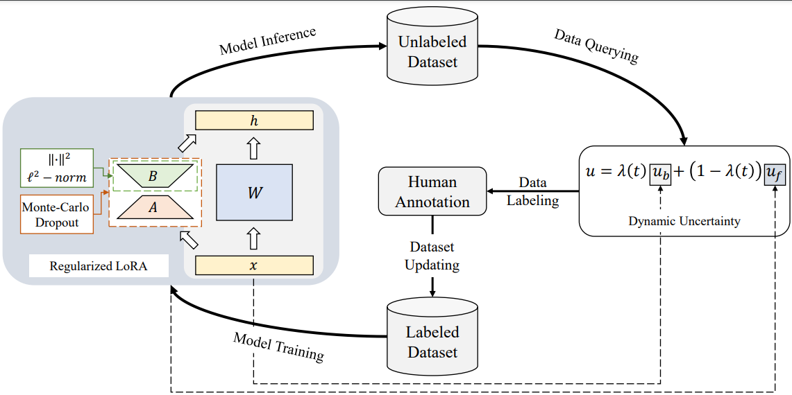

# STAR: Constraint LoRA with Dynamic Active Learning for Data-Efficient Fine-Tuning of Large Language Models

## Overall

We propose a novel DEFT (Data-Efficient Fine-Tuning) method, STAR, to effectively combine PEFT (Parameter Efficient Fine-Tuning) with active learning through criterion revision and model regularization.

<p align="center"> </p>

## Requirements
```bash
conda create -n star python=3.10
conda activate star
pip install -r requirments
```

## Run
Our experiments are carried out with an NVIDIA A100 80GB GPU.
```
cd src
bash run.sh ${dataset} ${al}
```

## 📖Citation

```bibtex
@misc{zhang2024star,
title={STAR: Constraint LoRA with Dynamic Active Learning for Data-Efficient Fine-Tuning of Large Language Models},
    author={Linhai Zhang and Jialong Wu and Deyu Zhou and Guoqiang Xu},
    year={2024},
    eprint={2403.01165},
    archivePrefix={arXiv},
    primaryClass={cs.CL}
}
```
